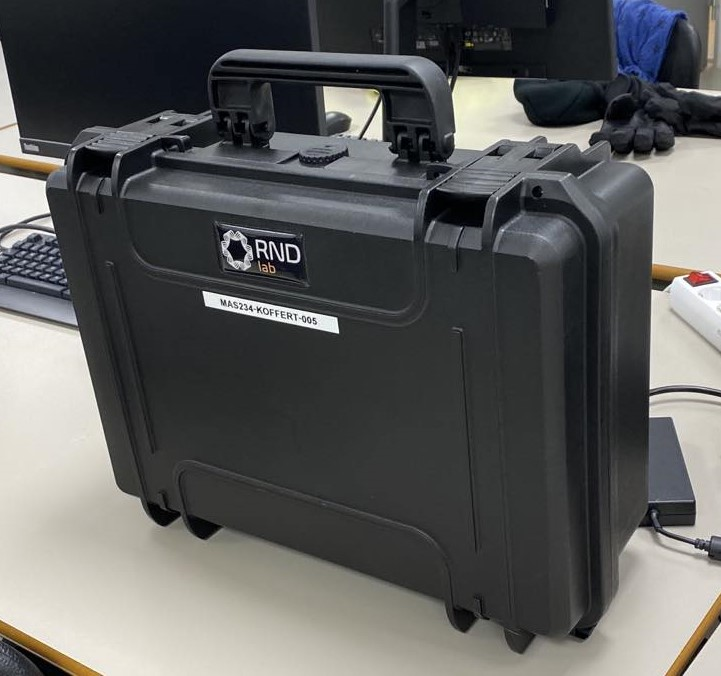
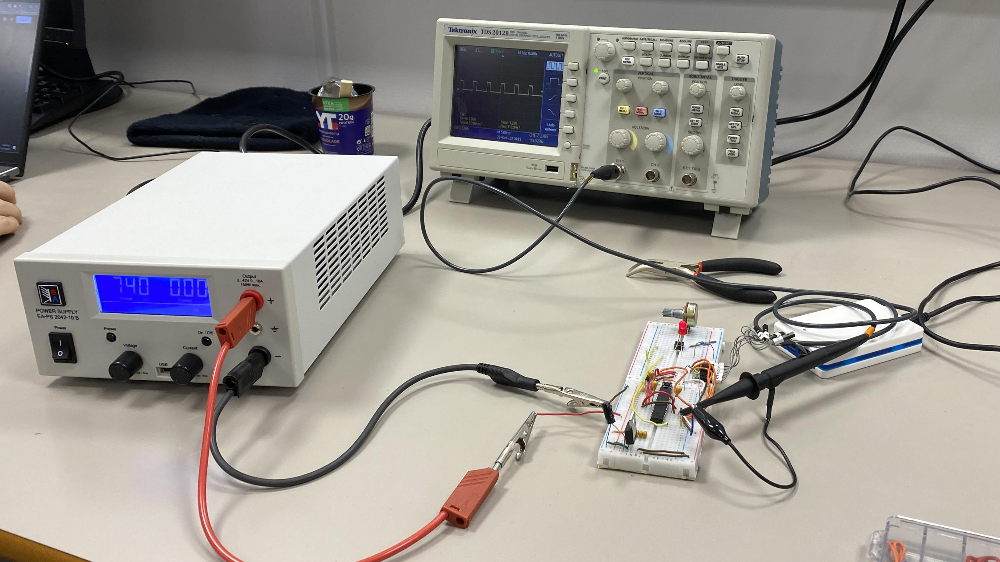
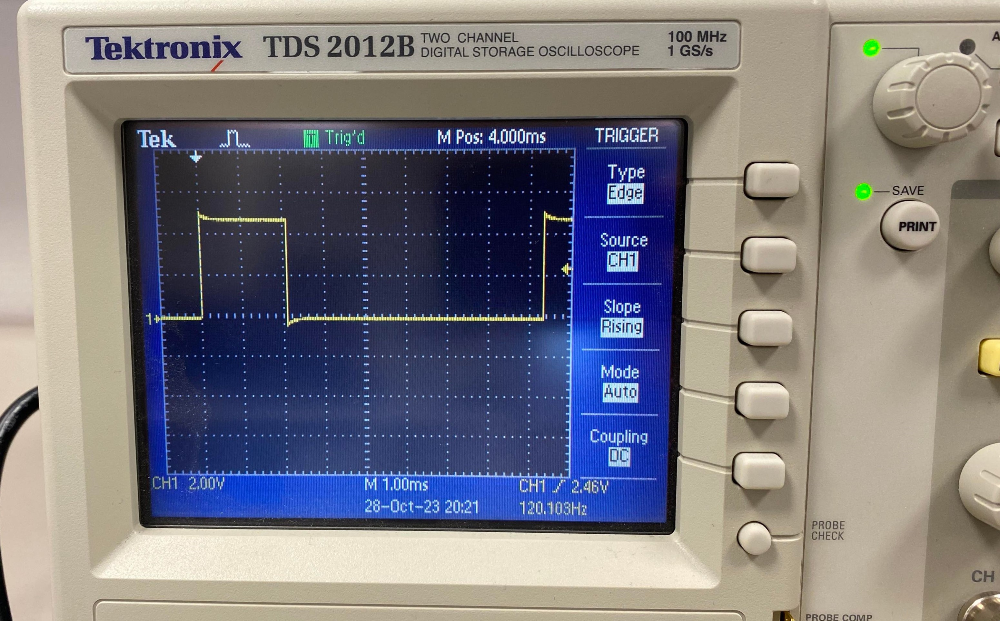
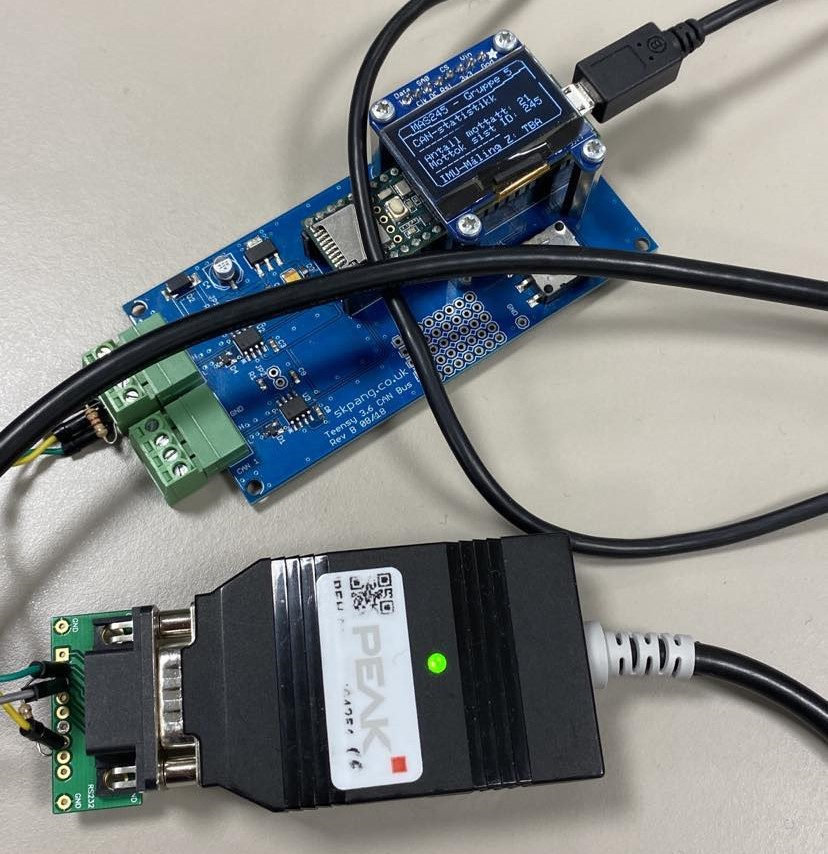
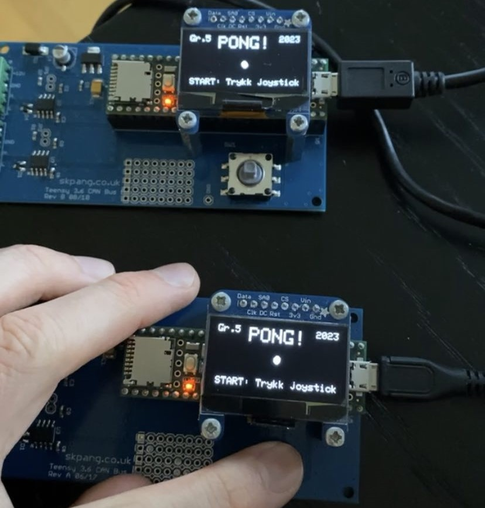
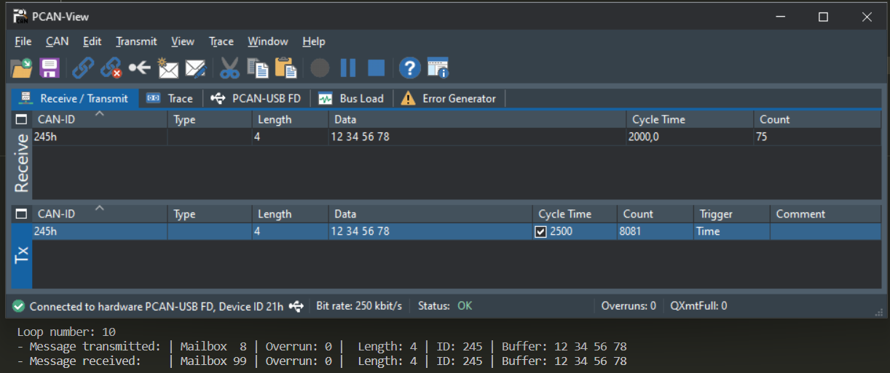
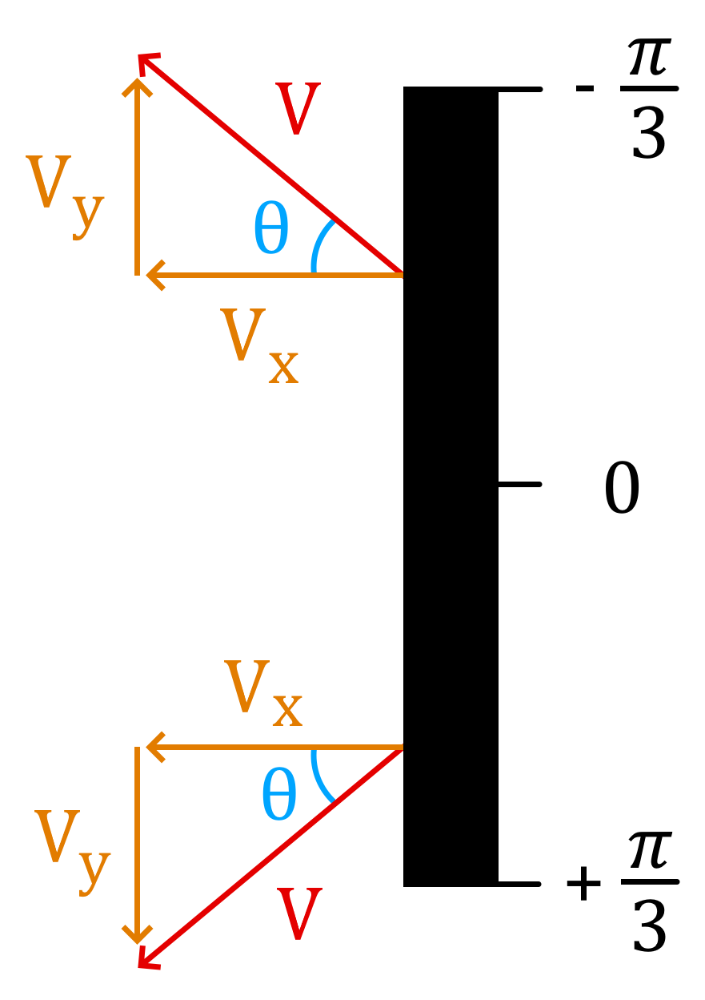
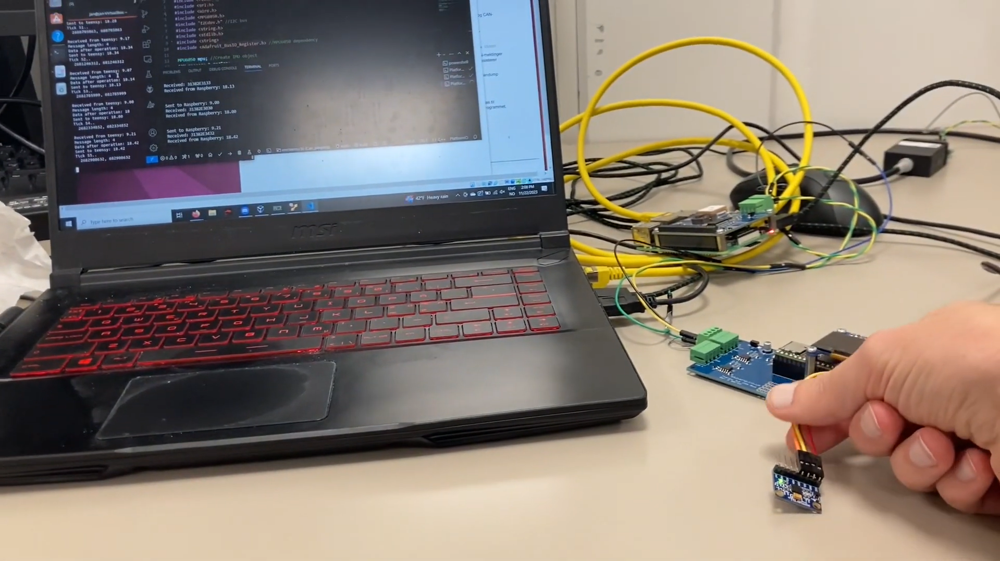

# MAS245 Project: Embedded Systems

*Project for the BSc. course MAS245 Embedded systems for mechatronics*

 \
Pelicase containing hardware for all 3 miniprojects :arrow_up:

#### Mini Project 1

#### Mini Project 2

#### Mini Project 3

## Overview

This project was separated into three miniprojects:
1) Circuit design and simple programming for a ATMEGA168-20PU *(interrupt, bitshift, bitmask, ADC, etc.)*
2) Usage of CAN Bus with Teensy 3.6 Carrier Board, sending and receiveing messages and creating Pong with a tiny interface on OLED *(see demo video in Videoer/Del 2)*
3) Create a Linux Distribution Software for Raspberry Pi 3. Was connected to Teensy with IMU for reading sensor data

## Demonstrations of the project

General detailed information is found in the report in current working directory. The videos are shown in the youtube videos below, else in folder named "Videoer".

### Mini Project 1

PWM Soft Blink Demonstration: \
https://www.youtube.com/watch?v=F8OoI1ZD1LE

ADC Demonstration \
https://www.youtube.com/shorts/v5W2hq8G5fk

### Mini Project 2

Pong Demonstration \
https://www.youtube.com/shorts/bh_fi18cQM4

### Mini Project 3

IMU-data over CAN bus Demonstration \
https://www.youtube.com/watch?v=3Lgbkens8SQ